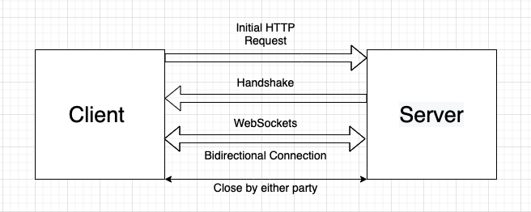

# analytika-nodejs

Analytika é um microsserviço desenvolvido para comunicações WebSocket para capturar metricas de clientes dentro de um site.
Para evitar sobrecarga dos servidores as metricas são salvas dentro [Redis](https://redis.io/), após a comunicação ser fechada os dados são processados, calculados, e 
salvos dentro do NoSQL [MongoDB](https://www.mongodb.com/).

